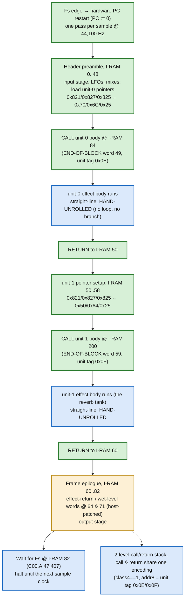

# Shared kernel &mdash; per-frame control flow

<!-- GENERATED by dsp/tools/gen_dsp_flowcharts.py -- DO NOT EDIT. -->

The 60-word common header (`../disasm/kernel.dsm`) is uploaded once at boot and runs **every sample frame**. It is the backbone every effect shares: it sets up each unit's data pointers, CALLs the two effect bodies in turn, and closes with the output epilogue. This control flow is **PROVEN BY CONSTRUCTION** (`notes/kn5000-dsp-headerdecode.md`): the header loads the same three pointer registers twice, so a body must run and return between the two loads.

Key facts (all from `notes/kn5000-dsp-headerdecode.md`):

- **Per-frame hardware PC restart** &mdash; the `Fs-RST`/`PC-RST` pins restart the PC every sample; there is *no* software frame loop. The last word, `C00.A.47.407` at I-RAM 82, waits for the next Fs (that `hi12=0xC00` occurs **zero** times in 2974 body words). *(MEASURED)*
- **Call & return share one encoding** &mdash; the transfer rides on the unit tag `class4==1 && addr8 &isin; {0x0E, 0x0F}`, not on the END-OF-BLOCK bit; the default action after an END-OF-BLOCK word is fall-through. *(PROVEN)*
- **A 2-level stack** &mdash; unit 0 is called at word 49 and returns to 50; unit 1 at word 59 returns to 60. Both units are resident at once but run time-multiplexed. *(PROVEN)*
- **Bodies are branchless, hand-unrolled** &mdash; no word carries the entry addresses 84/200 and two exhaustive branch-field scans are negative; there is no loop to branch back to. *(MEASURED)*
- **The epilogue (I-RAM 60..82) is the output stage** &mdash; the only two words the host patches per effect, I-RAM 64 and 71, carry the unit tags in their default form and a per-slot-invariant `lo12` (0x445/0x446): the effect-return / wet-level words. *(INFERRED, strong)*

Legend and method: [`README.md`](README.md). Narrative: the MAME development blog, KN5000 effects-DSP series (Parts 78-84).
