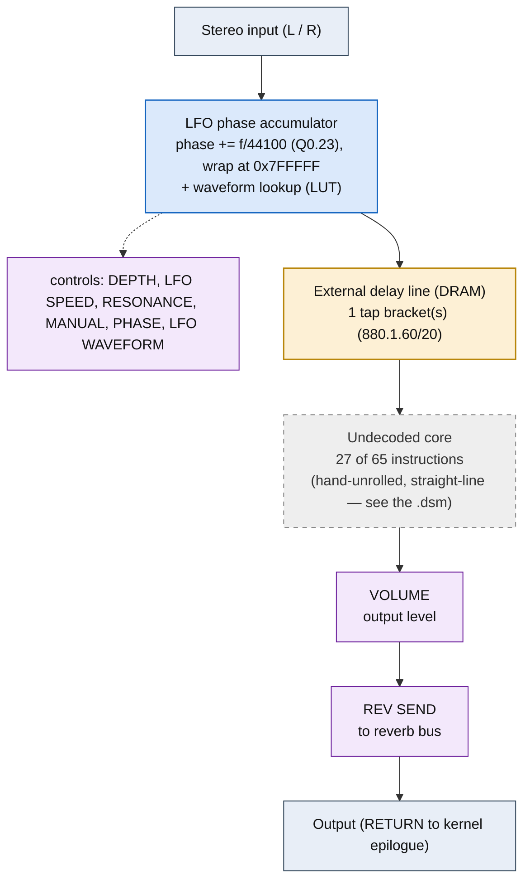

# FLANGER &mdash; signal-flow flowchart

<!-- GENERATED by dsp/tools/gen_dsp_flowcharts.py -- DO NOT EDIT. -->
<!-- Structure comes from the ROM words + the notes; edit those and re-run. -->

Image rep **algo 4** &middot; slots 4 &middot; **unit 0** (I-RAM load 84) &middot; family **modulation** &middot; confidence **medium**.

> flanger: swept all-pass chain, 0.3 feedback, wet mix

**65 words**, 18 class-A coefficient multiplies (12 named), 27 instructions still opaque. Landmarks detected: 2 LFO phase word(s), 1 DRAM tap bracket(s), 2 waveshaper LUT selector(s).

**UI parameters** (MEASURED, `notes/kn5000-dsp-paramlist.md`): DEPTH, LFO SPEED, RESONANCE, MANUAL, PHASE, LFO WAVEFORM, VOLUME, REV SEND.

Per-instruction detail: [`../disasm/prog04_flanger.dsm`](../disasm/prog04_flanger.dsm). Confidence legend and method: [`README.md`](README.md). Narrative: the MAME development blog, KN5000 effects-DSP series (Parts 78-84). Reference: the project docs site, `/effects-dsp/`.
