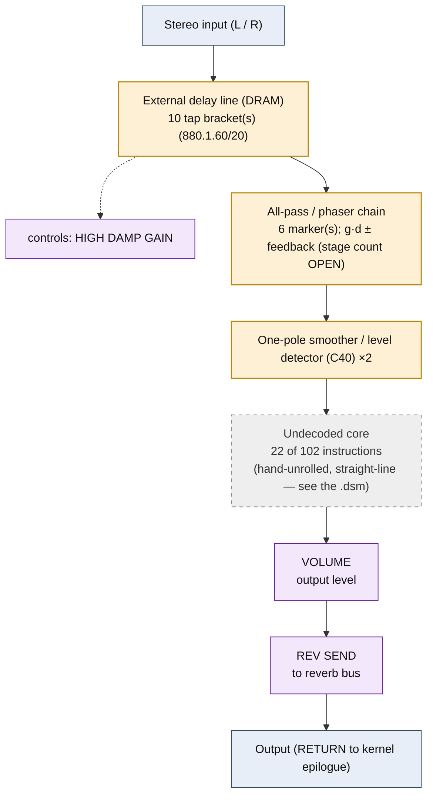

# GATED REVERB &mdash; signal-flow flowchart

<!-- GENERATED by dsp/tools/gen_dsp_flowcharts.py -- DO NOT EDIT. -->
<!-- Structure comes from the ROM words + the notes; edit those and re-run. -->

Image rep **algo 8** &middot; slots 8 &middot; **unit 0** (I-RAM load 84) &middot; family **reverb** &middot; confidence **medium**.

> gated reverb: all-pass ring + hold gate

**102 words**, 22 class-A coefficient multiplies (7 named), 22 instructions still opaque. Landmarks detected: 2 envelope/damping word(s), 10 DRAM tap bracket(s), 6 all-pass marker(s).

**UI parameters** (MEASURED, `notes/kn5000-dsp-paramlist.md`): GATE TIME, HIGH DAMP GAIN, THRESHOLD, MASK TIME, VOLUME, REV SEND.

Per-instruction detail: [`../disasm/prog08_gated_reverb.dsm`](../disasm/prog08_gated_reverb.dsm). Confidence legend and method: [`README.md`](README.md). Narrative: the MAME development blog, KN5000 effects-DSP series (Parts 78-84). Reference: the project docs site, `/effects-dsp/`.
