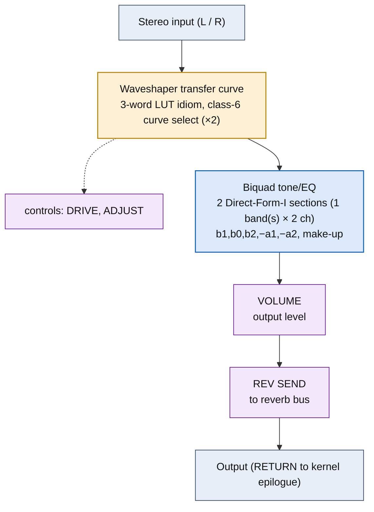

# OVERDRIVE &mdash; signal-flow flowchart

<!-- GENERATED by dsp/tools/gen_dsp_flowcharts.py -- DO NOT EDIT. -->
<!-- Structure comes from the ROM words + the notes; edit those and re-run. -->

Image rep **algo 33** &middot; slots 33 &middot; **unit 0** (I-RAM load 84) &middot; family **distortion** &middot; confidence **high**.

> overdrive: waveshaper + smoother + 4kHz Butterworth tone

**63 words**, 18 class-A coefficient multiplies (4 named), 0 instructions still opaque. Landmarks detected: 2 biquad DF-I section(s), 2 waveshaper LUT selector(s), 2 class-8 post-sum step(s).

### Classic-topology match

**Most likely textbook topology:** Memoryless waveshaper (drive &rarr; nonlinearity &rarr; level) + optional tone biquad.

gain(drive) &rarr; nonlinear transfer &rarr; gain(level); OVERDRIVE/EXCITER append a DF-I tone biquad, FUZZ/DISTORTION are the bare (harder) shaper.

**Instruction hint:** the nonlinearity is a class-6 LUT (addr8 0x28) or a Horner polynomial via class-A MACs feeding SRC 0x10 (acc) back as operand (LIVE in OVERDRIVE: coeffs [0.019, 0.609, &minus;0.448, 0.750]); the tone stage is a DF-I biquad (ACT 0x12/0x13/0x14 &mdash; LIVE only in OVERDRIVE, ABSENT from FUZZ).

**UI parameters** (MEASURED, `notes/kn5000-dsp-paramlist.md`): DRIVE, ADJUST, VOLUME, REV SEND.

Per-instruction detail: [`../disasm/prog33_overdrive.dsm`](../disasm/prog33_overdrive.dsm). Confidence legend and method: [`README.md`](README.md). Narrative: the MAME development blog, KN5000 effects-DSP series (Parts 78-84). Reference: the project docs site, `/effects-dsp/`.
