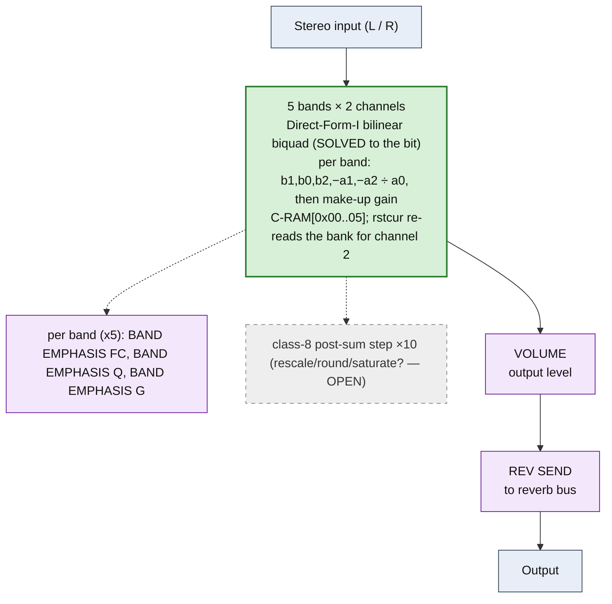

# PARAMETRIC EQ &mdash; signal-flow flowchart

<!-- GENERATED by dsp/tools/gen_dsp_flowcharts.py -- DO NOT EDIT. -->
<!-- Structure comes from the ROM words + the notes; edit those and re-run. -->

Image rep **algo 39** &middot; slots 39 &middot; **unit 0** (I-RAM load 84) &middot; family **eq** &middot; confidence **SOLVED**.

> parametric EQ: 5 bands x 2 channels, Direct-Form-I bilinear biquad (decoded to the bit); the reference program

**105 words**, 60 class-A coefficient multiplies (60 named), 10 instructions still opaque. Landmarks detected: 10 biquad DF-I section(s), 10 class-8 post-sum step(s).

**UI parameters** (MEASURED, `notes/kn5000-dsp-paramlist.md`): (BAND EMPHASIS FC, BAND EMPHASIS Q, BAND EMPHASIS G) x5, VOLUME, REV SEND.

Per-instruction detail: [`../disasm/prog39_parametric_eq.dsm`](../disasm/prog39_parametric_eq.dsm). Confidence legend and method: [`README.md`](README.md). Narrative: the MAME development blog, KN5000 effects-DSP series (Parts 78-84). Reference: the project docs site, `/effects-dsp/`.
