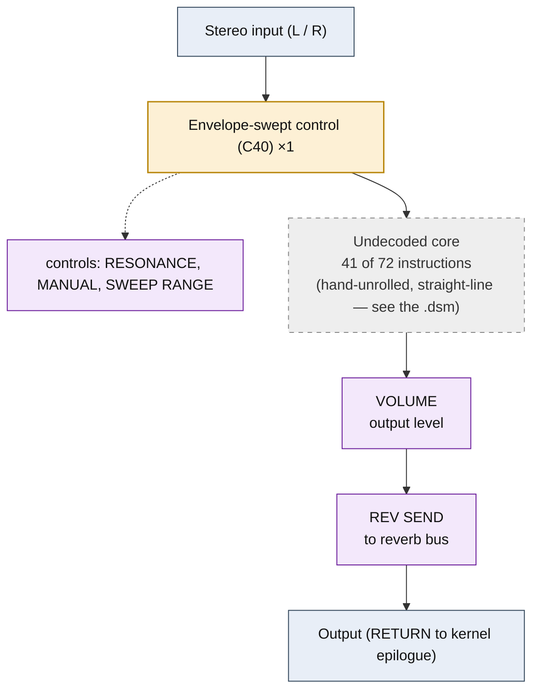

# AUTO WAH &mdash; signal-flow flowchart

<!-- GENERATED by dsp/tools/gen_dsp_flowcharts.py -- DO NOT EDIT. -->
<!-- Structure comes from the ROM words + the notes; edit those and re-run. -->

Image rep **algo 52** &middot; slots 52 &middot; **unit 0** (I-RAM load 84) &middot; family **filter** &middot; confidence **medium**.

> auto wah: envelope-swept resonator

**72 words**, 13 class-A coefficient multiplies (6 named), 41 instructions still opaque. Landmarks detected: 1 envelope/damping word(s), 2 class-8 post-sum step(s).

**UI parameters** (MEASURED, `notes/kn5000-dsp-paramlist.md`): RESONANCE, MANUAL, SWEEP RANGE, VOLUME, REV SEND.

Per-instruction detail: [`../disasm/prog52_auto_wah.dsm`](../disasm/prog52_auto_wah.dsm). Confidence legend and method: [`README.md`](README.md). Narrative: the MAME development blog, KN5000 effects-DSP series (Parts 78-84). Reference: the project docs site, `/effects-dsp/`.
