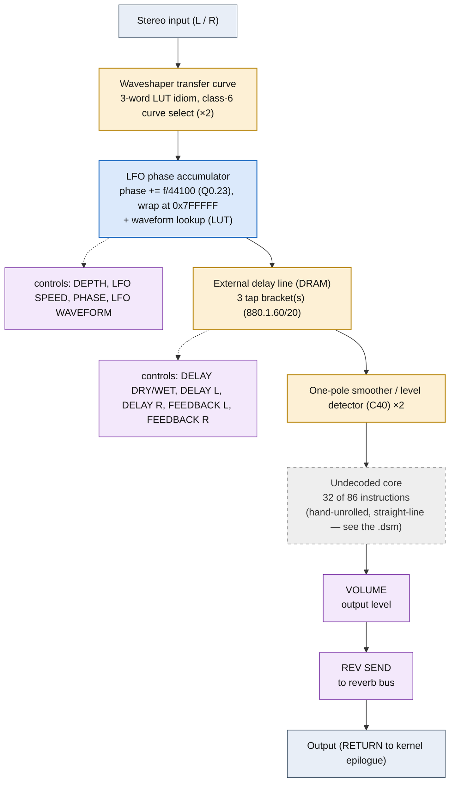

# S.DELAY+VIBRATO &mdash; signal-flow flowchart

<!-- GENERATED by dsp/tools/gen_dsp_flowcharts.py -- DO NOT EDIT. -->
<!-- Structure comes from the ROM words + the notes; edit those and re-run. -->

Image rep **algo 67** &middot; slots 67 &middot; **unit 0** (I-RAM load 84) &middot; family **combi** &middot; confidence **high**.

> single delay + vibrato

**86 words**, 22 class-A coefficient multiplies (14 named), 32 instructions still opaque. Landmarks detected: 2 LFO phase word(s), 2 envelope/damping word(s), 3 DRAM tap bracket(s), 2 waveshaper LUT selector(s).

**UI parameters** (MEASURED, `notes/kn5000-dsp-paramlist.md`): DELAY DRY/WET, DELAY L, DELAY R, FEEDBACK L, FEEDBACK R, DEPTH, LFO SPEED, PHASE, LFO WAVEFORM, VOLUME, REV SEND.

Per-instruction detail: [`../disasm/prog67_s_delay_vibrato.dsm`](../disasm/prog67_s_delay_vibrato.dsm). Confidence legend and method: [`README.md`](README.md). Narrative: the MAME development blog, KN5000 effects-DSP series (Parts 78-84). Reference: the project docs site, `/effects-dsp/`.
