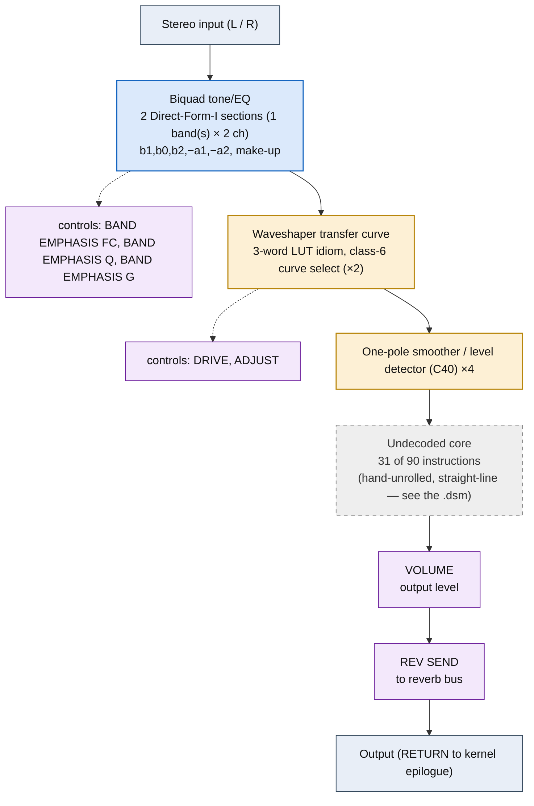

# PEQ+COMPR+DIST &mdash; signal-flow flowchart

<!-- GENERATED by dsp/tools/gen_dsp_flowcharts.py -- DO NOT EDIT. -->
<!-- Structure comes from the ROM words + the notes; edit those and re-run. -->

Image rep **algo 96** &middot; slots 96 &middot; **unit 0** (I-RAM load 84) &middot; family **combi** &middot; confidence **high**.

> PEQ + compressor + distortion

**90 words**, 30 class-A coefficient multiplies (16 named), 31 instructions still opaque. Landmarks detected: 2 biquad DF-I section(s), 4 envelope/damping word(s), 2 waveshaper LUT selector(s), 2 class-8 post-sum step(s).

**UI parameters** (MEASURED, `notes/kn5000-dsp-paramlist.md`): BAND EMPHASIS FC, BAND EMPHASIS Q, BAND EMPHASIS G, THRESHOLD, RATIO, ATTACK SENS., RELEASE SENS., DRIVE, ADJUST, VOLUME, REV SEND.

Per-instruction detail: [`../disasm/prog96_peq_compr_dist.dsm`](../disasm/prog96_peq_compr_dist.dsm). Confidence legend and method: [`README.md`](README.md). Narrative: the MAME development blog, KN5000 effects-DSP series (Parts 78-84). Reference: the project docs site, `/effects-dsp/`.
